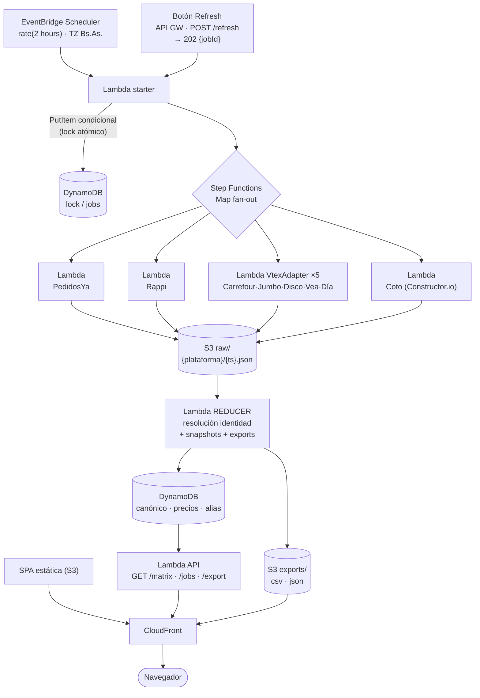

# birras_scrapper — Plan de arquitectura

> Dashboard web para comparar **precios de cerveza por marca, tipo y tamaño en cada ecommerce** que entrega en CABA (Austria 2001). Refresh on-demand + corrida automática cada 2 h, export CSV/JSON, infra en AWS.
>
> **Estado: planificación. Nada implementado todavía.** Documento para discutir y versionar.
> Última actualización: 2026-07-03.

---

## 1. Resumen ejecutivo

Se construye sobre el proyecto previo `cervezas_scrapers` (dos scrapers Python HTTP puro para **PedidosYa Market** y **Rappi Turbo** que ya emiten un schema unificado). El dashboard nuevo agrega: (a) una **vista matriz** que compara la misma cerveza entre ecommerces, (b) **refresh manual + cron 2 h**, (c) **export CSV/JSON**, y (d) los **supermercados online de CABA** como ecommerces adicionales.

**Arquitectura elegida: _Serverless Fan-out + Static Pivot_.** Todo Lambda + Step Functions + DynamoDB + S3/CloudFront, pago por uso, escala a cero, **~US$8–12/mes**. Se descartaron un monolito Next.js+Aurora (~US$60/mes) y una arquitectura Fargate+RDS 24/7 (~US$150/mes) por costo y sobre-ingeniería.

**Hallazgo clave (verificado en vivo):** la mayoría de los supermercados AR corren sobre **VTEX**, con **API pública de catálogo sin login**. Un único `VtexAdapter` parametrizable cubre **5 tiendas** (Carrefour, Jumbo, Disco, Vea, Día). Coto usa Constructor.io (otro adapter). **La Anónima queda fuera: es cadena patagónica y no entrega en CABA** — lo que además elimina el único scraper que necesitaba browser, dejando **todo el sistema HTTP puro**.

**El problema central no es la infra (barata y validada) sino la capa de datos:** (1) resolver la identidad del mismo producto entre plataformas sin ID común, y (2) la fragilidad inherente al scraping. Ambos se mitigan con aislamiento por adapter, observabilidad y curado humano — no con más infraestructura.

---

## 2. Alcance y decisiones cerradas

| Decisión | Valor | Implicancia |
|---|---|---|
| **Ecommerces** | PedidosYa, Rappi, Carrefour, Jumbo, Disco, Vea, Día, Coto (8) | Todos entregan en CABA; todos HTTP puro |
| **La Anónima** | **Fuera** | No entrega en CABA → sin scraper browser → sin Fargate/NAT |
| **Dirección** | Solo **Austria 2001, CABA** | Una dirección activa; modelo preparado para multi-barrio a futuro |
| **Historial de precios** | **Desde el día 1** | `price_snapshots` de primera clase + sparklines en el MVP |
| **Rappi login** | **Anónimo en Fase 1, login en Fase 2** | MVP sin credenciales; catálogo completo llega con los supermercados |
| **Costo objetivo** | **~US$8–12/mes** | Todo serverless, sin infra fija 24/7 |

**IaC = Terraform con módulos serverless** (`terraform-aws-modules/lambda`, `.../apigateway-v2`, etc.): el módulo de Lambda resuelve build + zip + publish del código Python, así se evita el boilerplate de empaquetado a mano y se conserva el `plan/apply` explícito de Terraform. State remoto en S3 + lock en DynamoDB.

**Defaults asumidos** (cambiables): reusar los 2 scrapers Python tal cual en Lambda; frontend = SPA React + TanStack Table en S3/CloudFront; cola de revisión de matching arranca como CSV versionado en git; orden de alta de supermercados: Carrefour → Día → Jumbo/Disco/Vea → Coto.

---

## 3. Arquitectura



**Principio de diseño:** separar **lecturas** (el dataset cambia 12 veces/día, no por request → estático, cacheado por CDN, gratis) de **acciones** (refresh/status → poquísimas invocaciones Lambda). El dashboard lee la matriz servida por CloudFront; solo el botón Refresh toca la API.

| Servicio | Rol | Por qué |
|---|---|---|
| **Lambda** (por adapter) | Scrapers HTTP puro | Ya son I/O-bound; arrancan en ms, se cobran por 100 ms, escalan a cero |
| **Step Functions** (`Map`) | Orquestación fan-out | Paraleliza adapters y **tolera fallo parcial** (una tienda cae, el resto sigue) |
| **EventBridge Scheduler** | Cron 2 h | Cron nativo managed, timezone Bs.As., target directo a Step Functions |
| **API Gateway (HTTP API)** | API pública | Más barato que REST API; fronting de refresh + lecturas |
| **DynamoDB on-demand** | Canónico, precios, jobs, lock | Escala a cero; `PutItem` condicional = lock atómico gratis; `SK=timestamp` = historial |
| **S3** | Raw snapshots + exports pre-generados | Permite **re-canonicalizar historial sin re-scrapear**; exports vía presigned URL |
| **CloudFront** | CDN único (front + API + descargas) | Lecturas cacheadas gratis; un solo dominio |
| **Secrets Manager** | Cookies de Rappi (Fase 2) | Login para catálogo completo |
| **SNS** | Alarma "0 productos por adapter" | Detector barato del modo de falla más común |
| **Terraform** (+ módulos serverless) | IaC | `plan/apply` explícito; `terraform-aws-modules/lambda` empaqueta el código; sumar ecommerce = un módulo/config |

---

## 4. Modelo de datos

DynamoDB single-table con overlays por entidad. Conceptualmente, siete colecciones:

- **platforms** — `{ platform_id, slug, display_name, adapter_type: vtex|constructorio|pedidosya|rappi, color_hex, active }`
- **stores** — `{ store_id, platform_id, external_store_id, address_label, adapter_config }` — `adapter_config` es un blob opaco por plataforma (VTEX: `base_url`, `category_path`, `sales_channel`; PedidosYa: `vendor_id`, `category_id`; Rappi: `store_id`, `subaisles`; Coto: `store_code`). El precio depende de la tienda, no solo de la plataforma.
- **canonical_products** — la identidad resuelta = **una fila de la matriz**. `{ canonical_id, brand_id, sub_brand, variant_id, volume_ml, container, pack_qty, gtin?, display_name, abv, color, review_status }`. Clave de negocio: `(brand_id, variant_id, volume_ml, container, pack_qty)`.
- **listings** — el SKU crudo de una tienda + su puente al canónico. `{ listing_id, store_id, external_product_id, canonical_id?, raw_name, raw_brand, raw_type, raw_volume_ml, raw_gtin, match_method, match_confidence, product_url }`
- **price_snapshots** — **append-only**, `SK=timestamp`. `{ listing_id, run_id, captured_at, price, price_before, discount_pct, price_per_100ml, in_stock, available }`. El "latest" es una proyección (GSI) del snapshot más reciente por listing. Habilita las sparklines desde el día 1.
- **aliases/overrides** — dato **editable**, nunca `if`s en código: `brand_alias (raw→brand_id)`, `variant_alias`, `volume_alias (354→355)`, `match_override (FORCE/BLOCK)`.
- **scrape_runs / jobs** — `{ run_id, trigger: schedule|manual, status, started_at, finished_at, stats_por_store }`. Alimenta el estado en la UI.

> **Regla de escalado:** a cientos de SKUs, el pivote marca×tipo×volumen y el fuzzy se resuelven en código dentro del reducer. Si al sumar tiendas el fuzzy se vuelve incómodo, subir a un **motor de texto embebido** (SQLite+trigram o DuckDB leído desde S3 dentro del reducer Lambda) **antes** que a cualquier base relacional 24/7 (Aurora/RDS) — así se conserva el costo casi-cero.

---

## 5. Resolución de identidad de producto

No hay ID común confiable (PedidosYa GTIN 100 %, Rappi 0 %, VTEX EAN poblado). Pipeline **determinística primero, difusa después, precisión > recall** (es peor unir dos cervezas distintas que dejar una suelta).

**Normalización previa (igual para toda fuente):** lowercase, sin tildes, `cc→ml`, separar número+unidad (`473cc`→`473 ml`), extraer `container` (lata/botella) y `pack_qty` antes de borrar stopwords (`cerveza`, `pack`, `x1`…). Resolver `brand_id` vía alias + fuzzy solo dentro del set cerrado de ~30 marcas (umbral ≥ 92). Resolver `variant_id` contra vocabulario controlado (`Corona 0.0`/`Cero`→`zero`).

**Cascada (primer match gana):**
1. **GTIN/EAN exacto** (conf 1.0) — ancla el canónico. Las 5 VTEX + PedidosYa lo traen poblado → súper-vs-súper y súper-vs-PedidosYa se resuelven casi gratis.
2. **Override FORCE/BLOCK** manual.
3. **Clave estructural exacta** `(brand_id, variant_id, volume_ml, pack_qty)` con container compatible (conf 0.95) — el caballo de batalla Rappi↔PedidosYa.
4. **Fuzzy** con gates duros (misma marca + mismo volumen): `0.55·token_set_ratio + 0.30·trigram_jaccard`. ≥ 0.90 auto-une; 0.75–0.90 → cola de revisión; < 0.75 → canónico nuevo (huérfano).

**Reglas clave:** los packs son entidades separadas (`pack_qty` en la clave; columna auxiliar `precio_unitario`). El volumen se fusiona por tabla explícita (`354→355`), nunca por tolerancia difusa. `container=null` matchea salvo conflicto explícito lata≠botella. El fuzzy por nombre queda reservado **de hecho para Rappi** (GTIN 0 %); todo lo demás ancla en GTIN o estructura.

Los productos sin match **no se ocultan**: cada uno tiene su fila con las demás columnas en `—`. Los huérfanos se re-evalúan cuando entra un ecommerce nuevo. La cola de revisión humana capitaliza su trabajo en las tablas de alias (arranca como CSV en git; puede evolucionar a un mini-CRUD).

---

## 6. Arquitectura de scrapers / adapters

**Interfaz común:** cada adapter implementa `fetch(store, adapter_config) → List[producto]` en el **schema unificado ya existente** (`{id, nombre, marca, tipo, volumen_ml, gtin, precio_actual, precio_anterior, stock…}`). El adapter **no conoce la base**; solo emite JSON. El reducer es el único que persiste. **Sumar un ecommerce = 1 adapter (o config) + 1 fila en `platforms` + 1 en `stores`.** Ni la API ni el front se tocan (columnas dinámicas, export prefijado por slug).

**Solo 3 tipos de adapter para 8 ecommerces:**

| Ecommerce | Adapter | Endpoint / patrón | Dificultad | Notas |
|---|---|---|---|---|
| **PedidosYa** | existente | `/groceries/web/v1/vendors/{id}/products?categoryId=…` | Fácil | GTIN 100 %. ⚠️ **hoy detrás de Cloudflare** → `curl_cffi` impersonando Chrome (ver abajo) |
| **Rappi** | existente | `__NEXT_DATA__` del HTML de `/tiendas/{id}-turbo/cervezas/{subaisle}` | Media | el SSG `_next/data/…json` da **404**; los productos vienen en el HTML SSR. **Fase 1 anónimo** (~64), Fase 2 login |

> **Verificado en vivo (2026-07-03):** PedidosYa 100 productos, Rappi 64. Ambos **HTTP-puros** con `curl_cffi`. Ver §Anti-bot abajo.
| **Carrefour** | `VtexAdapter` | `/api/catalog_system/pub/products/search?fq=C:/{cat}/` | Fácil | EAN poblado, sin login |
| **Jumbo / Disco / Vea / Día** | `VtexAdapter` (**solo config**) | mismo patrón, cambia `base_url` + `cat` | Fácil | Cencosud (Jumbo/Disco/Vea) + Día; Vea con cobertura CABA a validar |
| **Coto** | `ConstructorIoAdapter` | `https://ac.cnstrc.com/search/cerveza?key=…` | Media | Precio **por sucursal** nativo → filtrar tienda CABA; key del bundle JS (rota) |

**Anti-bot / fragilidad y mitigación:**
- **Cloudflare Bot Management (PedidosYa)** — desde ~mayo 2026 el endpoint (antes abierto) responde `403 cf-mitigated: challenge` a clientes `requests`/urllib (los delata el fingerprint TLS). **Mitigación (verificada): `curl_cffi` impersonando Chrome** → 200 JSON, sin browser. Es el cliente HTTP estándar de todos los adapters (`birras_scrapers/http.py`). Si Cloudflare escalara a un challenge **interactivo** (no solo fingerprint), recién ahí haría falta un `BrowserAdapter` (Playwright en Fargate) para esa plataforma — queda documentado como fallback aunque hoy no se use.
- **⚠️ Reputación de IP (PedidosYa desde AWS)** — Cloudflare también pesa la reputación de IP: desde la IP de Lambda (us-east-1, ASN de datacenter) PedidosYa devuelve **403 de forma intermitente** aunque `curl_cffi` pase el fingerprint (desde IP residencial AR anda siempre). **Mitigación en producción:** Step Functions reintenta el Task del scraper 4× con backoff (suele pasar) + Catch por item (un adapter bloqueado no tumba la corrida) + el reducer **no republica** una matriz de <2 plataformas (no degrada la última buena). Si se volviera **permanente**, el fix real es un **proxy residencial/AR** para el egress del adapter de PedidosYa (roadmap). Rappi anda bien desde AWS.
- **Rappi** — el SSG `_next/data/…json` da 404; se parsea `__NEXT_DATA__` del HTML SSR (una request/subaisle, más robusto). `buildId` se guarda como metadata pero ya no es dependencia dura.
- **Coto key Constructor.io** — tratarla como token frágil: re-extraer del bundle JS al inicio de cada corrida.
- **Aislamiento por adapter** — un adapter roto no tumba al resto; la corrida queda `partial`.
- **Alarma "0 productos"** — si un adapter devuelve 0 en una corrida → SNS/email. Detector más barato de anti-bot nuevo / key rotada / estructura cambiada.
- **Snapshot crudo siempre en S3** — permite re-canonicalizar todo el historial cuando mejore el matcher, sin re-scrapear.

> **Nota de packaging:** `curl_cffi` trae binario nativo (libcurl-impersonate) con wheels manylinux `aarch64` → funciona en Lambda arm64. El build de Terraform (`terraform-aws-modules/lambda`) baja el wheel correcto con `pip --platform`.

---

## 7. Refresh on-demand + cron cada 2 h

**Mismo entry point para ambos.** EventBridge Scheduler (`rate(2 hours)`, TZ Bs.As.) y el botón `POST /refresh` disparan la **misma Lambda starter** → mismo lock → mismo Step Functions. Una sola ruta de código, dos disparadores.

**Lock anti-concurrencia:** `PutItem` condicional en DynamoDB (`attribute_not_exists(PK)` + TTL, atómico). El segundo llamante concurrente **no falla**: recibe el `jobId` en curso. El reducer libera el lock al cerrar la corrida. Debounce natural — un Refresh manual no pisa a la corrida automática.

**Estado del job en la UI:** `POST /refresh` responde `202 {run_id, poll_url}`; el front poolea `GET /jobs/{run_id}` cada ~3 s (WebSocket sería sobre-ingeniería). La respuesta trae `status` (`queued|running|success|partial|failed`) y progreso por tienda (`stores_done/total`, productos, errores). El botón muestra spinner "Actualizando… (3/8 tiendas)"; al terminar, toast con el resumen. Si Rappi cae: run `partial`, banner ámbar "mostrando último precio conocido (hace 4 h)".

---

## 8. Export CSV / JSON

**Pre-generados en S3 por el reducer** al cerrar cada corrida (nada on-the-fly), servidos con **presigned URL**. Ambos son la **matriz aplanada** (una fila = una cerveza canónica, columnas por plataforma) y **respetan los filtros activos** (el botón reenvía la query string de `/matrix`).

- **CSV** — UTF-8 con BOM (Excel-AR con acentos). Columnas base fijas (`marca, tipo, volumen_ml, container, pack_qty, display_name, gtin`) + bloque por plataforma: `{slug}_price`, `{slug}_status`, `{slug}_discount_pct`, `{slug}_price_per_100ml`, `{slug}_url`. Agregar Coto solo añade columnas `coto_*`, no rompe consumidores.
- **JSON** — auto-descriptivo: metadata de la corrida (`source_run_id`, `captured_at`, dirección, filtros, plataformas) + `products[]` con `prices` keyed por slug (idéntico al `cells` de `/matrix`, mismo parser para API en vivo y archivo).
- `filename="birras_YYYYMMDD_HHMM.csv"`.

---

## 9. UX del dashboard

**Vista matriz** (requisito central): una fila por cerveza canónica, una columna por ecommerce activo (dinámicas — Coto/Carrefour entran sin tocar el front).

```
┌───────────────────────────────────────────────────────────────────────────┐
│ 🍺 birras_scrapper   Austria 2001, CABA        [🔄 Actualizar precios]      │
│ Última: hace 2h05 · Próxima: 14:00 · 8/8 tiendas OK                         │
├───────────────────────────────────────────────────────────────────────────┤
│ Marca[▾] Tipo[▾] Tamaño[▾] Ecommerce[☑…] [☑Stock][☑Oferta] [☑ $/100ml]     │
│ 🔍buscar…                            Ordenar[Más barato▾]  ⬇CSV ⬇JSON       │
├──────────────────────────┬───────────┬───────────┬───────────┬─────────────┤
│ CERVEZA                  │ PedidosYa │ Rappi     │ Carrefour │ Mejor       │
├──────────────────────────┼───────────┼───────────┼───────────┼─────────────┤
│ Quilmes Cristal 473ml lata│🟢$1.417▼30│ $1.590    │ $1.480    │ PedidosYa   │
│ 4.9° · Rubia · Lager     │ $299/100ml│ $336/100ml│ $313/100ml│ −$63        │
├──────────────────────────┼───────────┼───────────┼───────────┼─────────────┤
│ Stella Artois 269ml lata │ Sin stock │ — n/d     │ $980      │ Carrefour   │
└──────────────────────────┴───────────┴───────────┴───────────┴─────────────┘
```

- **Columna Cerveza** sticky: `display_name` en bold + línea gris con `abv°`, color, estilo. **Sparkline** de evolución de precio (historial desde día 1). Click en celda → `product_url`.
- **Resaltar más barato:** celda ganadora con fondo verde + 🟢; columna "Mejor" con plataforma y ahorro absoluto. Toggle **"Comparar por $/100 ml"** para cruzar tamaños distintos de forma justa.
- **Filtros combinables, reflejados en la URL** (compartible + consumido por Export): Marca / Tipo / Tamaño (multi), Ecommerce (checkboxes = columnas), toggles Con stock / En oferta, búsqueda debounced, orden.
- **Estados explícitos:** `in_stock` / `out_of_stock` ("Sin stock", ámbar) / `unavailable` ("— n/d", gris) / `not_listed` (celda vacía rayada). Tooltip con `captured_at` (frescura) por celda.

---

## 10. Costo mensual estimado

| Escenario | AWS/mes | Nota |
|---|---|---|
| **MVP (2 tiendas, Lambda-only)** | **~US$5–8** | Dominado por CloudWatch + DynamoDB, no el compute. Escala a cero. |
| **8 ecommerces (todos HTTP puro)** | **~US$8–12** | Cada adapter suma centavos de Lambda, no infra fija. |

Sin Fargate, sin NAT Gateway (~US$32/mes fijo), sin base relacional 24/7. Comparaciones descartadas: Aurora Serverless v2 (~US$45–70, piso 0.5 ACU) y Fargate+RDS Multi-AZ+ALB+NAT (~US$135–180).

---

## 11. Roadmap por fases

- **Fase 0 — Cimientos.** Terraform + módulos serverless (Lambda + DynamoDB + S3 + API GW + CloudFront) con backend de state en S3+DynamoDB. Portar los 2 scrapers actuales a Lambda tal cual (reusar Python). Schema unificado → S3 → DynamoDB. Sin resolución todavía: cada tienda por separado.
- **Fase 1 — MVP comparativo.** Resolución de identidad (GTIN + clave estructural + fuzzy para Rappi) + tablas de alias. **Vista matriz Rappi (anónimo) vs PedidosYa**, resaltar más barato, filtros, sparklines. Refresh on-demand + cron 2 h con lock. Export CSV/JSON. **Entregable demostrable.**
- **Fase 2 — Supermercados + Rappi completo.** `VtexAdapter` (Carrefour → Día → Jumbo/Disco/Vea, por config) + `ConstructorIoAdapter` (Coto). **Rappi con login** (Secrets Manager) para catálogo completo. EAN como ancla determinística entre las VTEX. Cola de revisión human-in-the-loop operativa.
- **Fase 3 — Robustez.** Alarma "0 productos", rollup diario para gráficos, curado de identidad maduro, mini-CRUD de alias (opcional). Multi-dirección si se decide.

---

## 12. Riesgos y mitigaciones

| Riesgo | Impacto | Mitigación |
|---|---|---|
| Scraper se rompe (buildId Rappi, key Coto, anti-bot) | Falta una columna | Aislamiento por adapter (run `partial`) + alarma "0 productos" + re-extracción de tokens por corrida |
| Falso positivo de matching (unir 2 cervezas distintas) | Matriz incorrecta | Precisión > recall; GTIN/estructura antes que fuzzy; cola de revisión; alias como dato |
| Cookies de Rappi expiran (Fase 2) | Rappi incompleto | Secrets Manager + detección de expiración → `partial` + alarma; MVP no depende de login |
| Cobertura CABA de Vea | Columna vacía | La tienda queda activa solo si entrega en Austria 2001 (chequeo en scrape time) |
| Cambio de ToS de una plataforma | Legal | Uso personal/educativo, volumen bajo; revisar ToS antes de escalar a uso comercial |

---

## 13. Decisiones abiertas restantes

Todo lo estructural está cerrado (ver §2). Quedan para más adelante, sin bloquear el arranque:
1. **Curación de identidad** — la cola de revisión arranca como CSV en git; evaluar mini-CRUD cuando el volumen de dudosos lo justifique.
2. **Multi-dirección** — hoy solo Austria 2001; el modelo lo soporta si se quiere comparar barrios más adelante.
3. **Descuentos complejos de Rappi** (`complex_discounts`, ej. "50 % en la 2ª unidad") — hoy ignorados; podrían sumarse como campo separado.

---

## Apéndice — Referencias

- Scrapers existentes: `~/Downloads/cervezas_scrapers/scraper_pedidosya.py`, `scraper_rappi.py`
- Snapshots de ejemplo: `cervezas_precios.json` (PedidosYa, 85), `cervezas_precios_rappi.json` (Rappi, 25)
- Handoff técnico previo (APIs, campos, trucos): `~/Downloads/cervezas_scrapers/HANDOFF.md`
- **PedidosYa:** `GET /groceries/web/v1/vendors/{vendor_id}/products?categoryId={uuid}&limit=50&page=N` (vendor 356102, cat cervezas `a63c106c-…`)
- **Rappi:** HTML `/tiendas/{store_id}-turbo/cervezas/{subaisle}` → `buildId` → `/_next/data/{buildId}/es-AR/ssg/{store_id}-turbo/cervezas/{subaisle}.json` (store 231868)
- **VTEX:** `GET /api/catalog_system/pub/products/search?fq=C:/{catId}/&_from=0&_to=49` (total en header `resources: 0-49/N`); categorías en `/api/catalog_system/pub/category/tree/3`
- **Coto:** `GET https://ac.cnstrc.com/search/cerveza?key={key}` (key del bundle JS; precio por sucursal en `price[]`)
